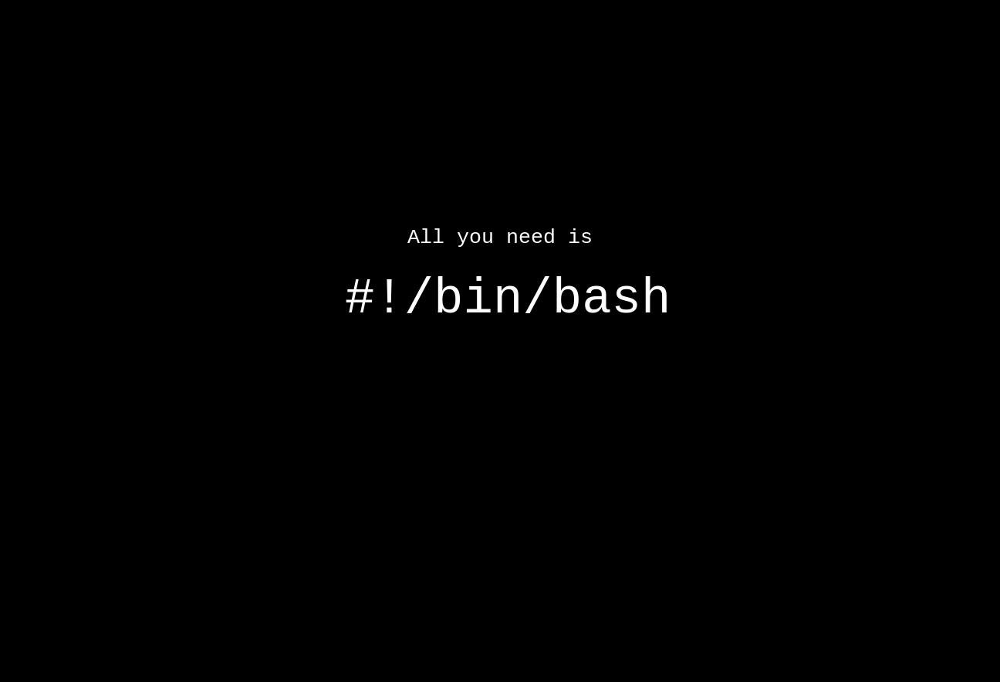

# 
bash-shell-scripting

## Commands to learn
-- ls, cd, ls –lrt, man 
-- cp, mv  
-- Softlink and Hardlink like ln –s and difference between them  
-- tar, find, zip etc  
-- Environment Variable  
-- PATH and LD_LIBRARY_PATH 
-- Absolute Pathname and relative Pathname, export command  
-- Creating profiles like .bashrc and .bash_profile 
-- which, cal, date, time 
-- mkdir, rm, rmdir 

-- cat, echo, who, whoami, tty, history  
-- pipe(|) and redirection(>)  
-- redirection to stdout, /dev/null, exec  
-- find command and xargs  
-- find file of particular type or size or modified time stamp  
-- chown, chmod, Useradd, groupadd, groupdel  
-- sort, cut, uniq, less, head, tail  
-- ps, top, vmstat 
-- cat /proc/partitions /proc/cpuinfo /proc/meminfo  

-- stty, stty –a, stty –echo, some other tty variant commands  
-- telnet, ftp, ssh, sshd, selinux(Just introduction)  
-- ACL and special file permissions like sticky bit, setuid etc 
-- od, dd, bc, which, locate, passwd  
-- fg, bg, nohup, daemon, setuid  
-- uname –a, system call revisit, user level versus kernel level 

-- Kill and signal handler  
-- Small script to trap a signal  
-- mount, ulimit, producing crash dump  
-- fdisk and gpart  
-- Mkfs, tunefs  
-- crontab  
-- log rotate  
-- Vi and search and replace  
-- Diff, sdiff, cmp  
-- Patch, and applying the patch 
-- Dos2unix and unix2dos  
-- Gzip, tar, cpio  
-- Lzma, 7zip and bzip2  

## Networking Commands to learn

-- Network setup  
-- Static versus dhcp IP address  
-- Ifconfig  
-- Route, netstat 
-- Ping, ping6, traceroute 
-- How to set proxy in Linux 
-- Minicom setup 
-- Run level 
-- dmesg, log messages like /var/log/messages  
-- Shudown, reboot, sync, rsyslog  
-- wget, curl  

-----
## Shell scripts
* echo and variables  
* Environment variables
* Export from with the shell
* If condition 
* If with or condition
* If, then, elif, else
* case statement(switch)
* While loop
* until
* While loop
* until
* Array declaration and processing in shell script
* Basename, dirname and processing arguments
* Writing and calling a function in shell script
* Test conditions like –le, -gt, -eq, = etc
* expr and expression evaluation
